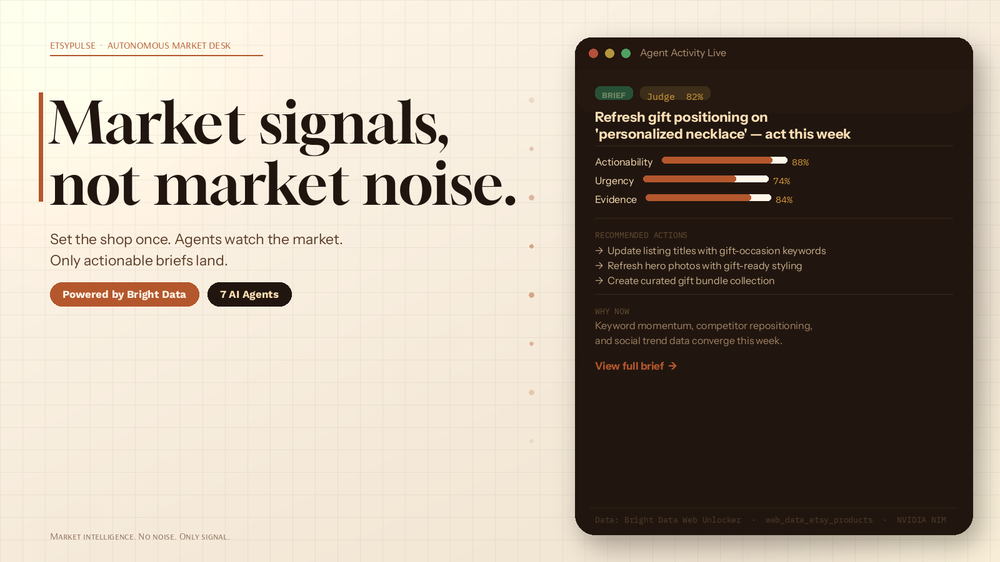
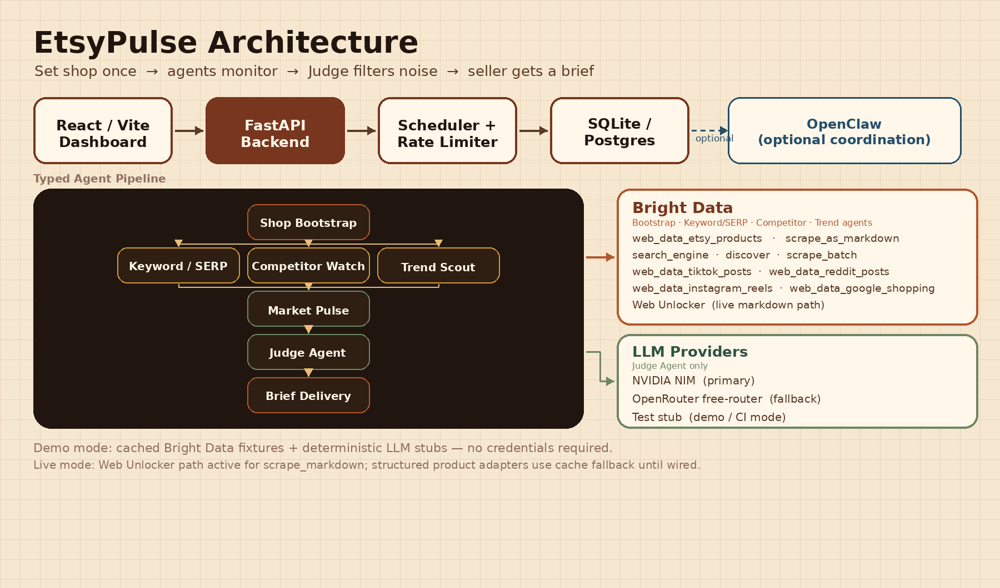

# EtsyPulse

<p align="center">
  
</p>

<p align="center">
  <a href="https://etsypulse.vercel.app"><strong>🚀 Live Demo</strong></a>&nbsp;&nbsp;·&nbsp;&nbsp;
  <a href="docs/submission/video/etsypulse-demo.mp4">Demo Video</a>&nbsp;&nbsp;·&nbsp;&nbsp;
  <a href="docs/submission/submission-package.md">Submission Package</a>&nbsp;&nbsp;·&nbsp;&nbsp;
  <a href="docs/submission/slides/etsypulse-slides.pdf">Slide Deck</a>
</p>

<p align="center">
  
  
  
  
</p>

---

EtsyPulse is an autonomous Etsy market-intelligence dashboard for sellers. A seller enters an Etsy shop URL once — the system bootstraps a shop profile, monitors keyword and SERP movement, watches competitors, scans social-commerce trends, scores every signal through a Judge Agent, and delivers only actionable briefs.

The demo runs fully in deterministic mode: no credentials required. All Bright Data calls load realistic cached fixtures; the Judge Agent uses deterministic scoring. A live Bright Data Web Unlocker path and live NVIDIA NIM / OpenRouter LLM path activate when credentials are configured.

---

## How It Works

```
Seller enters Etsy shop URL
        ↓
Shop Bootstrap Agent  ←  Bright Data: etsy_products + scrape_markdown
        ↓
   ┌────┴────────────────────┐
   │                         │
Keyword/SERP Agent      Competitor Watch Agent      Trend Scout Agent
search_engine · discover  etsy_products · scrape_batch  tiktok · reddit · instagram · shopping
   │                         │                           │
   └──────────────┬──────────┘───────────────────────────┘
                  ↓
         Market Pulse Agent  (normalises + deduplicates signals)
                  ↓
          Judge Agent  ←  NVIDIA NIM / OpenRouter LLM
    (scores: actionability · urgency · confidence · novelty · impact · evidence)
                  ↓
        Brief Delivery Agent  →  Seller-facing brief with recommended actions
```

---

## Features

- **FastAPI** backend with typed Pydantic schemas and agent contracts
- **React + Vite** dashboard: shop setup, actionable briefs, market signals, live activity, and debug traces
- **Seven-agent deterministic pipeline** — every demo run is reproducible without credentials
- **Bright Data integration** — `web_data_etsy_products`, `search_engine`, `scrape_as_markdown`, `discover`, `scrape_batch`, `web_data_tiktok_posts`, `web_data_reddit_posts`, `web_data_instagram_reels`, `web_data_google_shopping`; live Web Unlocker markdown path when configured
- **NVIDIA NIM primary LLM** with OpenRouter fallback; isolated test stub for CI
- **Scheduler** with per-shop duplicate suppression and configurable cadences
- **Per-IP and per-shop rate limiting** for hosted / public deployments
- **OpenClaw-compatible** — docs and config examples for optional multi-agent coordination

---

## Architecture

<p align="center">
  
</p>

The agent pipeline fans out from the shop profile into parallel Keyword/SERP, Competitor Watch, and Trend Scout agents — each calling specific Bright Data tools — then fans back in through Market Pulse normalization, Judge Agent scoring, and Brief Delivery. OpenClaw provides optional `agentToAgent` coordination without being required at runtime.

---

## Quick Start

### 1. Configure environment

```bash
cp .env.example .env
```

Demo mode is on by default — no credentials needed.

### 2. Run the backend

```bash
cd backend
python -m venv .venv && source .venv/bin/activate
pip install -r requirements.txt
uvicorn app.main:app --reload --port 8000
```

Health check:

```bash
curl http://localhost:8000/health
# → {"status":"ok","service":"etsypulse-api","demo_mode":true}
```

### 3. Run the frontend

```bash
cd frontend
npm install && npm run dev
```

Open **http://localhost:5173**, click **Run CaitlynMinimalist demo**, and watch agents run.

---

## API Endpoints

| Method | Path | Description |
|--------|------|-------------|
| `GET` | `/health` | Service health |
| `GET` | `/ready` | Readiness + DB check |
| `POST` | `/shops/bootstrap-request` | Bootstrap a shop profile |
| `GET` | `/shops/{shop_id}` | Get shop profile |
| `POST` | `/runs/start-demo` | Run the demo pipeline |
| `GET` | `/runs/{run_id}` | Get run details + signals |
| `POST` | `/scheduler/trigger` | Trigger a scheduled check |
| `GET` | `/scheduler/status` | Scheduler cadence + config |
| `GET` | `/activity` | Agent activity events |
| `GET` | `/briefs` | Judge-approved briefs |
| `GET` | `/debug/events` | Bright Data + LLM debug trace |
| `GET` | `/admin/debug/status` | Provider configuration status |
| `POST` | `/admin/live-smoke` | Controlled live provider check |

---

## Configuration

All settings come from `.env` or environment variables. Never commit real credentials.

| Variable | Default | Description |
|----------|---------|-------------|
| `DEMO_MODE` | `true` | Use cached fixtures and deterministic scoring |
| `DATABASE_URL` | SQLite | Local SQLite or hosted Postgres |
| `CORS_ORIGINS` | `http://localhost:5173` | Comma-separated allowed origins |
| `RATE_LIMIT_ENABLED` | `false` locally | Enable per-IP and per-shop limits |
| `BRIGHTDATA_API_KEY` | — | Bright Data credential for live mode |
| `BRIGHTDATA_UNLOCKER_ZONE` | — | Web Unlocker zone name |
| `NVIDIA_NIM_API_KEY` | — | NIM credential for live Judge scoring |
| `NVIDIA_NIM_MODEL` | — | NIM model identifier |
| `OPENROUTER_API_KEY` | — | Fallback LLM credential |
| `JUDGE_BRIEF_THRESHOLD` | `0.7` | Minimum Judge score to produce a brief |

See `.env.example` for the full variable reference.

---

## Live Mode

Set `DEMO_MODE=false` once provider credentials are configured. The live Bright Data path (`scrape_markdown` via Web Unlocker) and live Judge Agent LLM path (NVIDIA NIM → OpenRouter fallback) activate immediately. All other Bright Data tool abstractions fall back to cached fixtures until their dedicated live adapters are wired.

Check provider readiness (no secrets exposed):

```bash
curl http://localhost:8000/admin/debug/status
```

Run a controlled live smoke check:

```bash
curl -X POST http://localhost:8000/admin/live-smoke
```

---

## Demo Mode

Demo mode is the recommended path for evaluation:

- Cached CaitlynMinimalist shop profile provides a realistic seller scenario immediately
- All Bright Data tool calls load fixtures from `backend/app/demo_data/brightdata_samples/`
- Judge Agent uses deterministic scoring derived from signal properties — no live LLM calls
- Every run is reproducible and credential-free

Validate fixtures:

```bash
PYTHONPATH=backend backend/.venv/bin/python backend/scripts/validate_brightdata_fixtures.py
```

---

## Deployment

EtsyPulse is built for a two-service hackathon deployment:

- **Frontend** — Vercel static app, configured by `vercel.json`
- **Backend** — Render Docker web service, configured by `render.yaml` + `backend/Dockerfile`
- **Database** — Render Postgres via `DATABASE_URL`

Production checks:

```bash
PYTHONPATH=backend backend/.venv/bin/python backend/scripts/validate_deployment_env.py
docker build -t etsypulse-api:local backend
```

See `docs/deployment.md` for the full runbook.

---

## Submission Materials

| Artifact | Path |
|----------|------|
| Submission package | `docs/submission/submission-package.md` |
| Demo video | `docs/submission/video/etsypulse-demo.mp4` |
| Slide deck | `docs/submission/slides/etsypulse-slides.pdf` |
| Architecture diagram | `docs/submission/architecture-diagram.png` |
| Screenshots | `docs/submission/screenshots/` |
| Cover image | `docs/submission/assets/etsypulse-cover.png` |

---

## Development

```bash
# Backend tests (48 tests, no credentials needed)
PYTHONPATH=backend backend/.venv/bin/python -m pytest backend/tests -q

# Backend compile check
PYTHONPATH=backend backend/.venv/bin/python -m py_compile \
  backend/app/*.py backend/app/agents/*.py backend/app/services/*.py

# Frontend build
cd frontend && npm run build

# Root convenience commands
npm run backend:dev
npm run backend:test
npm run frontend:dev
npm run frontend:build
```

---

## OpenClaw

OpenClaw is optional. EtsyPulse includes docs and config examples so the agent roster can be coordinated through local workflow and `agentToAgent` routing — no Discord or channel setup required.

Start here: [`docs/openclaw.md`](docs/openclaw.md)

---

## License

Hackathon prototype — add a license before public reuse.
